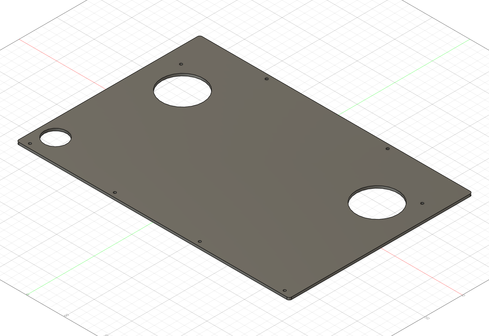
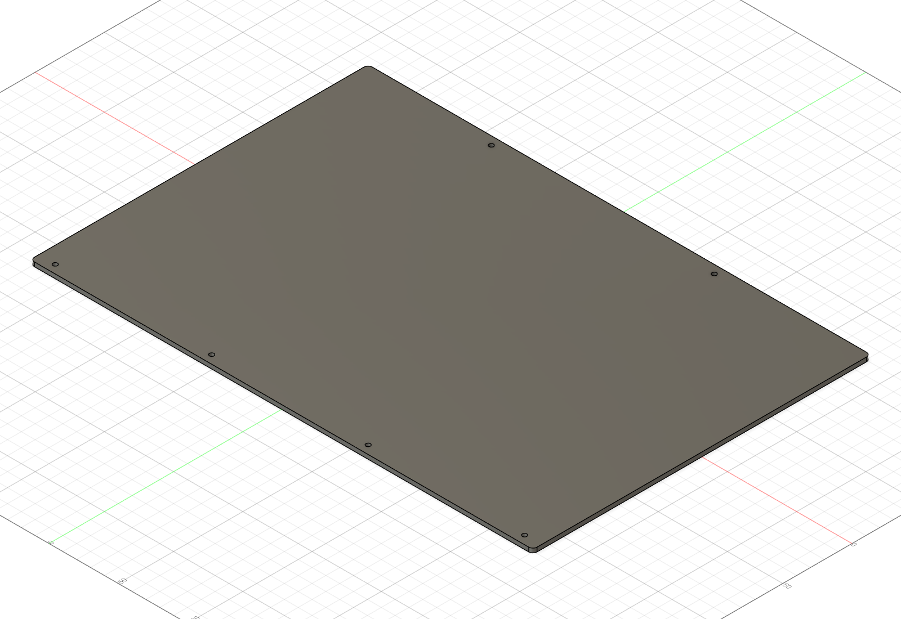

# Water-Cooled-Laptop [中文]

**语言 / Language: 中文（简体） | [English](README.en.md)**

笔记本水冷改装与透明亚克力开放式外壳项目。当前整理版本包含制作照片，以及 **REV10（2026-09-01）三块亚克力板**的加工文件、Fusion 源文件和生成脚本。

A water-cooled laptop project with an open-frame acrylic enclosure. This repository contains build photos and the REV10 design files for three acrylic plates.


## 文档语言

所有文档均提供中文和英文两版：原有 `.md` 文件标注 **[中文]**，新增 `.en.md` 文件标注 **[English]**。每页顶部可切换语言；CAD、源码、照片和 JSON 报告由两版共用。

| 文档 | 中文 | English |
| --- | --- | --- |
| 项目首页 | [中文](README.md) | [English](README.en.md) |
| CAD 与生成脚本 | [中文](CAD/README.md) | [English](CAD/README.en.md) |
| 材料清单 | [中文](docs/BOM.md) | [English](docs/BOM.en.md) |
| 加工说明 | [中文](docs/MANUFACTURING.md) | [English](docs/MANUFACTURING.en.md) |
| 制作照片 | [中文](docs/BUILD-PHOTOS.md) | [English](docs/BUILD-PHOTOS.en.md) |
| 版本说明 | [中文](docs/RELEASE-NOTES.md) | [English](docs/RELEASE-NOTES.en.md) |
| 待补资料 | [中文](docs/TODO.md) | [English](docs/TODO.en.md) |
| ESP32 控制 | [中文](electronics/ESP32-control/README.md) | [English](electronics/ESP32-control/README.en.md) |

## 当前内容

| 内容 | 状态 |
| --- | --- |
| 三块亚克力板 CAD | 每块均有 DXF、STEP、F3D，数量各 1 |
| 建模生成源码 | 三个 Fusion Python 脚本及几何检查工具 |
| 制作照片 | 已有 6 张；另附 3 张 CAD 预览 |
| 材料清单 | 已确认三块板；其余零件规格待补 |
| ESP32 控制 | 预留目录，是否使用及相关资料待确认 |
| 整机装配模型、PDF 工程图 | 待补 |
| 温度、功耗、噪声测试 | 待补 |
| 开源许可证 | 待项目所有者选择，尚未添加 LICENSE |

实物照片用于展示制作过程；照片与 REV10 每处孔位是否完全一致尚未核对。

## 文件结构

```text
Water-Cooled-Laptop/
├── README.md                   # 中文
├── README.en.md                # English
├── .gitignore
├── .gitattributes
├── images/                     # 原有实物照片、三块板的 CAD 预览
├── CAD/
│   ├── README.md / README.en.md # 中文 / English：Fusion 使用说明
│   ├── RAMSidePlate.*          # 有风扇开口的板，另有 QTY1_1to1.dxf
│   ├── SolidBackPlate.*        # 带 5 × 5 mm 顶边缺口的背板
│   ├── ThirdPlate.*            # 只保留六个 M3 通孔的第三块板
│   ├── FusionScripts/          # 三个建模脚本
│   └── tools/                  # 理论几何检查
├── electronics/
│   └── ESP32-control/          # README.md / README.en.md
└── docs/
    ├── BOM.md / BOM.en.md
    ├── MANUFACTURING.md / MANUFACTURING.en.md
    ├── BUILD-PHOTOS.md / BUILD-PHOTOS.en.md
    ├── RELEASE-NOTES.md / RELEASE-NOTES.en.md
    ├── TODO.md / TODO.en.md
    └── reports/               # 参数报告及已有几何检查结果
```

保留原始零件名以便与加工文件对应。当前没有整机 `enclosure.step`，也没有将单块板命名为整机装配。

## 下载与加工

三块板均为透明亚克力，外形 **363 × 244 mm**、厚 **3 mm**、外角 **R3 mm**。通孔直径为 **3.2 mm**，用于 M3 紧固件。

| 零件（各 1 块） | 激光切割 DXF（mm，1:1） | 三维 STEP | Fusion 源文件 |
| --- | --- | --- | --- |
| RAMSidePlate | [DXF](CAD/RAMSidePlate_QTY1_1to1.dxf) | [STEP](CAD/RAMSidePlate.step) | [F3D](CAD/RAMSidePlate.f3d) |
| SolidBackPlate | [DXF](CAD/SolidBackPlate_QTY1_1to1.dxf) | [STEP](CAD/SolidBackPlate.step) | [F3D](CAD/SolidBackPlate.f3d) |
| ThirdPlate | [DXF](CAD/ThirdPlate_QTY1_1to1.dxf) | [STEP](CAD/ThirdPlate.step) | [F3D](CAD/ThirdPlate.f3d) |

- RAMSidePlate：两个 Ø55 mm 风扇开口、一个 Ø30 mm 操作孔、8 个 M3 通孔。
- SolidBackPlate：12 个 M3 通孔；顶边向下开 5 × 5 mm 缺口，缺口右侧边缘距板右边 180 mm。
- ThirdPlate：6 个 M3 通孔，无风扇开口或操作孔。

加工前阅读 [加工说明](docs/MANUFACTURING.md)，按 **mm、1:1** 导入 DXF；不要从照片或预览图取尺寸。孔位适配本项目，笔记本型号和装配间距待补，不能据此认定适用于其他机型。

## 建模与制作记录

- [打开和重新生成模型](CAD/README.md)
- [材料清单](docs/BOM.md)
- [制作过程照片](docs/BUILD-PHOTOS.md)
- [REV10 版本说明](docs/RELEASE-NOTES.md)
- [待补资料](docs/TODO.md)

### CAD 预览

| RAMSidePlate | SolidBackPlate | ThirdPlate |
| --- | --- | --- |
|  |  |  |

## 许可证

许可证尚未选择。本次整理没有代项目所有者添加授权条款；发布前请确认 CAD、代码、文档和照片的授权范围并添加正式 LICENSE。
